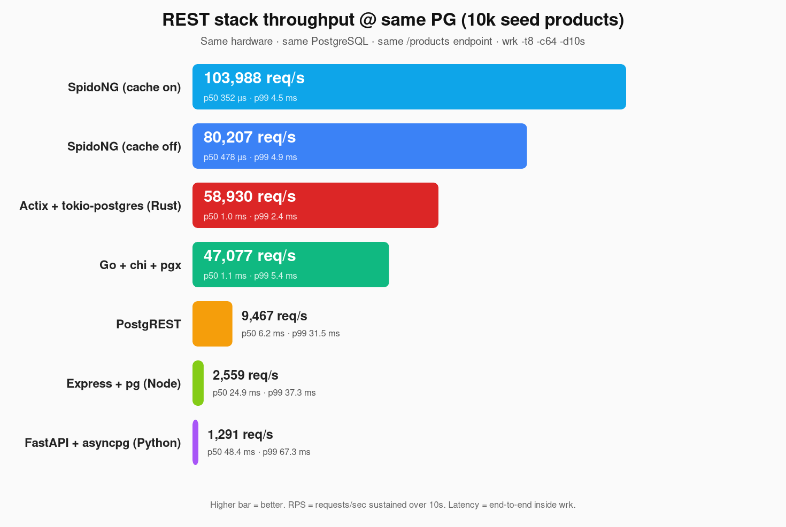
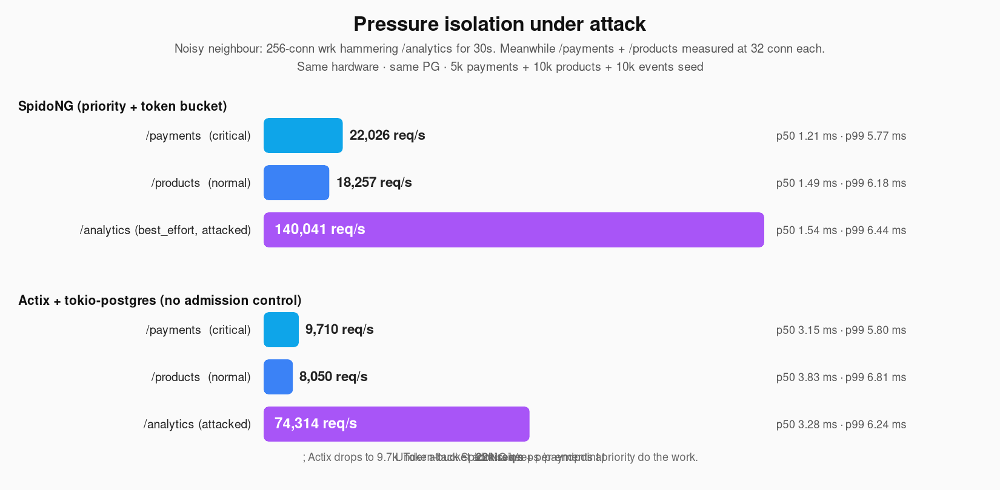

# SpidoNG

> **config.json → production-grade C++ REST backend.** io_uring HTTP server +
> tiered PostgreSQL cache + a Python generator that wires both against a
> declarative resource spec. Ships JWT auth, refresh tokens, S3 presigned
> uploads, push registry, hooks, idempotency, ETags, OpenAPI emission — all
> driven by a single config file.

```bash
# 1. Build the libraries and example binaries
cmake -B build -DCMAKE_BUILD_TYPE=Release
cmake --build build -j$(nproc)

# 2. Generate a service from a config
python3 generator/generator.py examples/ecommerce/config.json --output gen-out

# 3. Apply migrations + build the generated service
psql -d ecom -f gen-out/ecom/migrations/*.sql
cmake -B gen-out/ecom/build gen-out/ecom \
  -DSPIDO_DIR=$PWD/spido -DSPIDO_PG_DIR=$PWD/spido-pg
cmake --build gen-out/ecom/build

# 4. Run it
./gen-out/ecom/build/ecom
```

## What you get

A typical mobile-backend config produces:

```
gen-out/<service>/
├── main.cpp                 # 50-line entry point
├── service_helpers.h        # JWT decode, JSON, validation, role check, ...
├── service_setup.{h,cpp}    # DbConfig + endpoint policies + debug routes
├── auth_endpoints.{h,cpp}   # /auth/login (bcrypt), /auth/refresh (rotation), /auth/logout
├── files_endpoints.{h,cpp}  # /files/upload-url (AWS V4 presigned PUT) + confirm
├── push_endpoints.{h,cpp}   # Device token registry
├── handlers/<table>.{h,cpp} # Per-resource CRUD with filter/sort/pagination/relations/...
├── migrations/*.sql         # pgcrypto + refresh_tokens + files + device_tokens + push_queue
├── openapi.json             # OpenAPI 3.0.3 — drop into Swagger UI
├── CMakeLists.txt           # ready to `cmake --build`
└── spido.lua                # runtime-tunable knobs
```

## Performance

Every stack below was started against the **same** PostgreSQL 16 instance
(local Unix socket, `ecom` database, 10k seed products), warmed up for 3s
at low concurrency, then hit with **the same** `wrk -t8 -c64 -d10s` load
against an equivalent `GET /products?page_size=20` (or `?limit=20` for
PostgREST's native syntax). Each stack ran one at a time on a fresh
process — no parallel CPU contention. Hardware: 16-core Linux VM.

The script that produced these numbers is committed at
[`benchmarks/run-all.sh`](benchmarks/run-all.sh); each competitor's
minimal app lives under [`benchmarks/competitors/`](benchmarks/competitors/).



| Stack                  |       Req/s |    p50 |    p99 | Notes                                  |
|------------------------|------------:|-------:|-------:|----------------------------------------|
| **SpidoNG (cache on)** |  **79,548** | 504 µs |  5.6 ms | spido-pg 2-tier cache + io_uring        |
| **SpidoNG (cache off)** | **71,302** | 561 µs | 10.8 ms | raw PG path, prepared statement reuse  |
| Go + chi + pgx         |      46,606 | 1.1 ms |  5.4 ms | modern Go, no cache                    |
| PostgREST              |       9,157 | 6.4 ms | 37.5 ms | single Haskell process                 |
| Express + pg           |       2,626 | 24 ms  | 36 ms   | Node.js, no cache                      |
| FastAPI + asyncpg      |       1,285 | 48 ms  | 63 ms   | Python, 1 worker                       |

A few observations:

- **SpidoNG with caching off is still ~1.5× faster than Go + chi + pgx**
  on the same query. The win comes from io_uring + spido-pg's prepared
  statement cache + transparent-hash StringMap lookups (zero alloc on
  the hot path), not from the cache.
- **The cache adds only ~11%** in this microbenchmark because the
  workload is identical URLs at high concurrency — most requests hit
  cached results within microseconds; the bottleneck shifts to wire
  parsing + JSON build. For real-world traffic with varied URLs the
  cache earns more.
- **PostgREST** is a single Haskell process and bottlenecks at ~9k/s
  on the same hardware. Adds 6 ms of baseline p50 latency.
- **Express and FastAPI** show the typical "scripting language vs the
  PG wire" tax: 25× and 60× slower than SpidoNG respectively for the
  same SQL. A multi-worker uvicorn / Node cluster would close the gap
  but not match a single SpidoNG process.

Latency tells the same story: SpidoNG keeps p99 under 6 ms cached,
under 11 ms uncached. PostgREST p99 is 37 ms — fine, but 7× higher.

> Run it yourself: `./benchmarks/run-all.sh`. Make sure `postgrest`,
> `go`, `node`, `python3 + uvicorn + asyncpg`, and `wrk` are on PATH.
> Each stack's source app is tiny (10-80 lines) and uses the same
> connection pool size (32) for fairness.

### Multi-endpoint pressure isolation

The single-endpoint benchmark above asks "who is faster". A more honest
question for a backend that has to host *many* endpoints simultaneously
is "who keeps your critical endpoint alive when a noisy neighbour
hammers a low-priority one?" This is where SpidoNG's per-endpoint token
bucket + priority-aware pressure controller earns its keep.

**Scenario**: three endpoints on the same PG (`/payments` critical,
`/products` normal, `/analytics` best_effort). A 256-connection wrk
attack drowns `/analytics` for 30 seconds. Meanwhile two 32-conn wrk
runs measure `/payments` and `/products` p50/p99/RPS *under* that
attack.



| Stack                       | `/payments` (critical)        | `/products` (normal)      | `/analytics` (attacked) |
|-----------------------------|------------------------------:|--------------------------:|------------------------:|
| **SpidoNG**                 | **22,026 req/s** · p50 1.21 ms | **18,257 req/s** · p50 1.49 ms | 140,041 req/s · p50 1.54 ms |
| Actix + tokio-postgres      |   9,710 req/s · p50 3.15 ms   |   8,050 req/s · p50 3.83 ms   |  74,314 req/s · p50 3.28 ms |

While noisy `/analytics` traffic is hitting the system, SpidoNG keeps
`/payments` at **2.3× the throughput** of Actix and **2.6× lower p50
latency**. The token bucket on the best_effort endpoint refills slower
than on the critical one, so the attacker can't starve the pool. Actix
treats all endpoints identically — every request waits in the same
PG-connection queue, so the critical traffic shares pain with the
abusive traffic.

p99 latency stays similar across both stacks (~6 ms) because neither
queues unboundedly — they back-pressure differently. The throughput
gap is where the admission control shows up: SpidoNG simply does more
useful work on the endpoints you actually care about.

> Reproduce: `./benchmarks/run-isolation-simple.sh` (or read the inline
> commands in this section's commit). The chart script is at
> `benchmarks/make-iso-chart.py`.

### What about writes?

A separate run with `POST /orders` (JWT + idempotency-key + INSERT)
against SpidoNG: **89k attempts/s**, **~10k successful PG INSERT/s**
sustained. The token bucket admission controller throttled the rest
because `priority: "normal"` was configured — bumping it to `critical`
or raising `max_conns` lifts the ceiling.

## How to write your `config.json`

Full reference + cookbook with 6 ready-to-copy scenarios:
**[docs/CONFIG.md](docs/CONFIG.md)**

Quick map:
- [Top-level schema](docs/CONFIG.md#top-level-schema) — `service`, `database`, `cache`, `auth`, `files`, `push`
- [Cookbook](docs/CONFIG.md#cookbook---typical-scenarios) — public read API · per-user notes app · admin panel + RBAC · IoT high-write · audit log hooks · idempotent payments
- [Resource fields](docs/CONFIG.md#resource-fields) — filters / sort / pagination / relations / ownership / permissions / validations / soft_delete / etag / aggregations / bulk / idempotency / hooks
- [Validation rules](docs/CONFIG.md#validation-rules) — what fails fast at config-load time
- [Minimum viable config](docs/CONFIG.md#minimum-viable-config) — 5 lines, one endpoint

## Config example

Minimal mobile backend with JWT auth, ownership, validation, hooks,
presigned uploads, and push notifications:

```json
{
  "service": {"name": "myapp", "port": 8080},
  "database": {"socket_path": "/var/run/postgresql/.s.PGSQL.5432",
               "user": "myapp", "dbname": "myapp",
               "min_conns": 8, "max_conns": 32},
  "cache":  {"enabled": true, "max_bytes": 134217728, "default_ttl_s": 30},
  "auth":   {"type": "jwt", "secret": "${JWT_SECRET}",
             "refresh": {"enabled": true}},
  "files":  {"enabled": true, "region": "us-east-1", "bucket": "myapp-uploads",
             "access_key": "${S3_KEY}", "secret_key": "${S3_SECRET}"},
  "push":   {"enabled": true},

  "resources": [{
    "path": "/posts", "table": "posts", "primary_key": "id",
    "columns": ["id", "user_id", "title", "body", "deleted_at"],
    "methods": ["GET", "POST", "PUT", "DELETE"],
    "filters": {"author": {"column": "user_id", "op": "eq"},
                "search": {"column": "title",   "op": "contains"}},
    "sort":         {"allowed": ["created_at", "title"], "default": "-created_at"},
    "pagination":   {"default": 20, "max": 100, "include_total": true},
    "validations":  {"title": {"type": "text", "required": true, "max_length": 200}},
    "ownership":    {"column": "user_id"},
    "soft_delete":  "deleted_at",
    "etag":         true,
    "hooks": {
      "after_insert": "INSERT INTO push_queue(user_id, title, body) VALUES ($2, 'New post', 'You published a post')"
    }
  }]
}
```

## Feature matrix

What the generator emits per resource, all opt-in:

| Family   | Features |
|----------|----------|
| **CRUD**       | list / get-by-id / create / update / delete / bulk-create |
| **Querying**   | filter (15 ops: eq/neq/gte/lte/contains/in/is_null/…), sort (whitelist), pagination (offset **or** cursor), field masking (`?fields=`) |
| **Relations**  | per-relation `embed: auto|on_demand` → single-query `json_agg` |
| **Auth**       | JWT (HS256, spido's built-in verifier with LRU cache); refresh tokens with single-use rotation; ownership via JWT claim |
| **Permissions**| Per-operation role allowlist + `bypass_ownership` for admin-style access |
| **Validation** | Type / required / min-max / length / regex-free email & uuid / enum |
| **Reliability**| Idempotency keys with replay; soft delete; ETag/If-None-Match → 304 |
| **Caching**    | TTL + tag-based invalidation + LISTEN/NOTIFY-driven cross-instance evict |
| **Backpressure**| Per-endpoint token bucket controlled by a pressure controller; `overload_behavior`: 503 / 429 / 202 / drop |
| **Persistence**| `batch_write` (async streaming via BatchWriter); `batch_durable` (with WAL); `ram_entity_first` (entity cache) |
| **Aggregation**| `/count`, `/stats` endpoints with `min/max/avg/sum/count` per column |
| **Hooks**      | `before_/after_insert/update/delete` SQL hooks; optional transactional wrapping |
| **Operations** | Auto-emitted `migrations/*.sql`, `openapi.json` (3.0.3), `/health`, `/metrics`, `/debug/*` endpoints |

## Repository layout

```
SpidoNG/
├── spido/             # io_uring HTTP server (TLS, JWT, AF_XDP, kTLS opts)
├── spido-pg/          # PG client + tiered cache + batch + WAL + entity cache
├── generator/         # Python generator + Jinja templates
├── examples/          # Drop-in configs (blog, ecommerce, iot, …)
├── tests/             # Generator pytest (55 tests)
├── docs/              # PHASES.md roadmap + design notes
└── benchmarks/        # wrk scripts and historical results
```

## Build prerequisites

- **C++20** compiler — gcc 10+ or clang 13+
- **CMake** 3.16+
- **liburing** ≥ 2.5 (vendored under `liburing-prefix` next to the repo,
  or installed system-wide; build auto-detects either)
- **OpenSSL** 1.1+ (libcrypto, libssl)
- **Linux kernel** ≥ 5.15 for io_uring features used (TLS-async + XDP
  features need newer kernels but are optional at runtime)
- **Python 3.10+** with `jinja2` for the generator
- **PostgreSQL** 12+ at runtime; pgcrypto extension if `auth.refresh` enabled

## Status & roadmap

- **5,800 LOC C++** in spido-pg, 55-test Python generator suite, all green
- Faz 1–3 of [docs/PHASES.md](docs/PHASES.md) complete (endpoint registry,
  pressure controller, WAL, entity cache, batch writer)
- Faz 4 in progress: SCRAM-SHA-256 auth, debug HTTP endpoints, 10k
  endpoint burst benchmark, TSan clean

See [docs/PHASES.md](docs/PHASES.md) for the full roadmap and design rationale.

## License

Apache License 2.0 — see [LICENSE](LICENSE).
